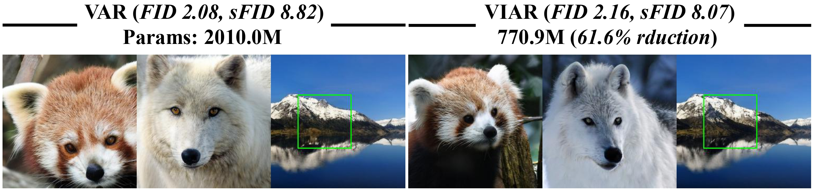
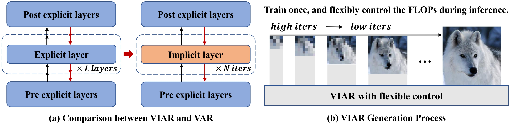
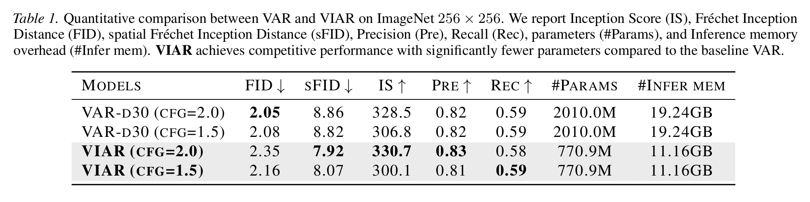
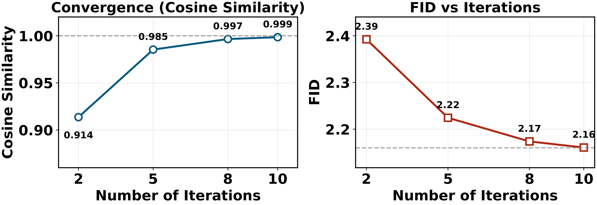

# VIAR: Visual Implicit Autoregressive Modeling [ICML 2026]

<div align="center">

[](https://arxiv.org/abs/2605.01220)&nbsp;
[](https://huggingface.co/mobiushy/VIAR)&nbsp;
</div>

<p align="center">
  
</p>

VIAR is an image generation project based on visual autoregressive modeling with implicit refinement support.

This README covers environment setup, checkpoint and ImageNet data preparation, training, FID/IS evaluation, and image generation inference.

## Method

<p align="center">
  
</p>

Overview of VIAR. (a) The Implicit Architecture. We replace the deep explicit VAR stack with a single implicit equilibrium layer between shallow pre/post-layers. Training via Jacobian-Free Backpropagation unrolls only the last m iterations for gradients, ensuring constant memory usage. (b) VIAR Generation Process. During inference, unlike standard VAR which is constrained to fixed computation, VIAR flexibly control compute across scales through an iterations knob, thereby reducing high-resolution redundancy, latency, and KV cache usage while preserving quality.

## Environment Setup

Create and activate a Python environment, then install dependencies from `requirements.txt`.

```bash
conda create -n viar python=3.10 -y
conda activate viar
pip install -r requirements.txt
```

## Checkpoints

All checkpoints are expected under `ckpts/`:

```text
ckpts/
|-- vae_ch160v4096z32.pth
|-- var_d30.pth
`-- viar.pth
```

Create the checkpoint directory `ckpts/`.
Download the VAE checkpoint and the original VAR-D30 checkpoint from HuggingFace:
[vae.pth](https://huggingface.co/FoundationVision/var/resolve/main/vae_ch160v4096z32.pth)
and
[var_d30.pth](https://huggingface.co/FoundationVision/var/resolve/main/var_d30.pth). 
VIAR checkpoint is available here: 
[viar.pth](https://huggingface.co/mobiushy/VIAR/blob/main/viar.pth)


## Data Preparation

Training uses `torchvision.datasets.DatasetFolder` to load ImageNet-1K. The data directory should follow this structure:

```text
/path/to/imagenet-1k/
|-- train/
|   |-- n01440764/
|   |-- n01443537/
|   `-- ...
`-- val/
    |-- n01440764/
    |-- n01443537/
    `-- ...
```

Before training, update `--data_path` in `scripts/train.sh` to your ImageNet root directory:

```bash
--data_path=/path/to/imagenet-1k
```

For evaluation, `scripts/eval.sh` requires an ImageNet 256x256 reference file `VIRTUAL_imagenet256_labeled.npz` in the first argument. Download this reference file: [256x256](https://openaipublic.blob.core.windows.net/diffusion/jul-2021/ref_batches/imagenet/256/VIRTUAL_imagenet256_labeled.npz).


## Training

The training script is located at `scripts/train.sh`.

```bash
bash scripts/train.sh
```

By default, the script launches single-node 8-GPU distributed training:

```bash
torchrun \
  --nnodes=1 \
  --node_rank=0 \
  --nproc_per_node=8 \
  --master_addr=127.0.0.1 \
  --master_port=7777 \
  train.py \
  --data_path=/path/to/imagenet-1k \
  --depth=30 \
  --bs=272 \
  --ep=350 \
  --tblr=8e-5 \
  --fp16=1 \
  --alng=1e-5 \
  --wpe=0.01 \
  --twde=0.08 \
  --use_implicit=True \
  --p_depth=5
```

Training outputs logs, TensorBoard files, and checkpoints to `local_output/` by default:

```text
local_output/
|-- tb-*/
|-- ar-ckpt-best.pth
|-- ar-ckpt-last.pth
|-- stdout.txt
`-- ...
```

## Evaluation

Use `scripts/eval.sh` to sample images and evaluate metrics such as FID, Inception Score, sFID, Precision, and Recall.

```bash
bash scripts/eval.sh
```

The VIAR sampling command in `scripts/eval.sh` is:

```bash
python sampling.py \
  --ckpt_path ckpts/viar.pth \
  --vae_ckpt ckpts/vae_ch160v4096z32.pth \
  --cfg 1.5 \
  --depth 30 \
  --sample_dir samples \
  --use_implicit True \
  --iter_left 10 \
  --iter_right 10
```

This command generates 50 images for each of the 1,000 ImageNet classes, for a total of 50,000 images. The images are saved to:

```text
samples/implicit-viar.pth-cfg-1.5-seed-1/
```

`sampling.py` then packs the generated images into:

```text
samples/implicit-viar.pth-cfg-1.5-seed-1.npz
```

After sampling, `scripts/eval.sh` calls `evaluator.py` to compute metrics:

```bash
python evaluator.py \
  data/VIRTUAL_imagenet256_labeled.npz \
  samples/implicit-viar.pth-cfg-1.5-seed-1.npz
```

`evaluator.py` reports:

`FID`, `sFID`, `Inception Score`, `Precision`, `Recall`

<p align="center">
  
</p>


## Image Generation Inference

Use `gen_img.py` for class-conditional image generation.

Generate images in VIAR implicit mode:

```bash
python gen_img.py \
  --use_implicit \
  --save_grid
```

Generated images are saved to `gen_images/` by default.

You can control the number of iterations per scale by adjusting the argments `iter_left` and `iter_right` in `scripts\eval.sh`.

<p align="center">
  
</p>

Our experiments show that the implicit equilibrium layer stabilizes quickly at each scale. Hence, at inference time only a small number of fixed-point iterations are needed for accurate refinement.

## Citation
```
@article{viar,
      title={Visual Implicit Autoregressive Modeling}, 
      author={Jiang, Pengfei and Luo, Jixiang and Lin, Luxi and Huang, Zhaohong and Li, Xuelong},
      journal={arXiv preprint arXiv:2605.01220},
      year={2026}
}
```
